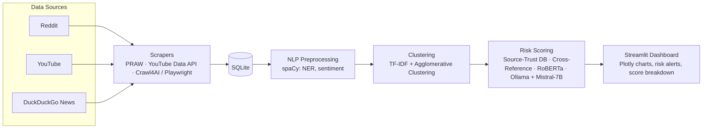
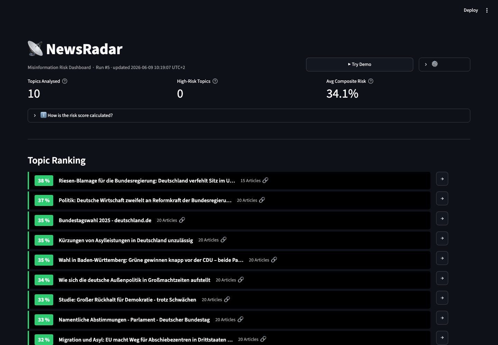
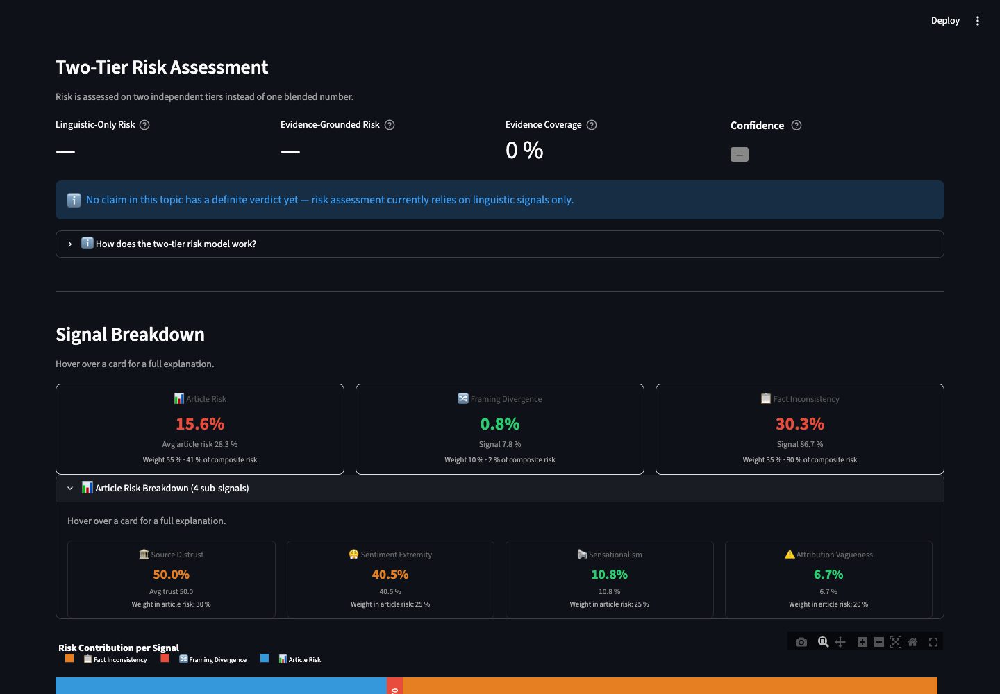

# Hot Topic & Misinformation Intelligence Dashboard


Real-time dashboard that monitors trending political and cyber-related topics across Reddit, YouTube, and web news — then scores each topic's misinformation risk using NLP-based analysis.

---

## Problem

Coordinated narratives and low-credibility claims spread across Reddit, YouTube, and news outlets faster than anyone can track by hand. Analysts need a way to spot which *trending* topics carry real misinformation risk — without reading every thread and article manually, and without trusting a black-box score they can't inspect.

## Solution

An end-to-end pipeline that scrapes trending content, groups near-duplicate stories into unified topics, and scores each topic's misinformation risk from several independent signals — sentiment, source credibility, cross-reference count, and linguistic markers. Every score ships with a transparent breakdown in an interactive dashboard, so the reasoning is inspectable, not just the final number.

## Architecture



## Screenshots

| Dashboard overview | Risk score breakdown |
|---|---|
|  |  |

## Tech Stack

| Layer | Tools |
|---|---|
| Data ingestion | PRAW, YouTube Data API v3, Crawl4AI / Playwright |
| NLP | spaCy, HuggingFace Transformers (RoBERTa), Ollama + Mistral 7B |
| Scoring | scikit-learn, RapidFuzz, MediaBiasFactCheck (curated CSV) |
| Frontend | Streamlit, Plotly |
| Automation | n8n (self-hosted via Docker) |
| Storage | SQLite |

## Demo Video

> *Placeholder — record a 60–90s walkthrough: open the dashboard → pick a trending topic → show the risk score and its breakdown.*

`[demo video link]`

---

## How it works

1. **Scrape** — Collects trending content from Reddit, YouTube, and DuckDuckGo news
2. **Cluster** — Groups related articles into unified topics using TF-IDF + agglomerative clustering
3. **Score** — Evaluates each topic for misinformation risk (sentiment, source credibility, cross-references, linguistic markers)
4. **Display** — Streamlit dashboard with interactive charts, risk alerts, and transparent score breakdowns

## Quick start

```bash
# Clone and set up
git clone https://github.com/jeorgesilva/hot-topics-dashboard.git
cd hot-topics-dashboard
python -m venv .venv
source .venv/bin/activate  # Windows: .venv\Scripts\activate
pip install -r requirements.txt
python -m spacy download en_core_web_sm

# Configure API keys
cp config/.env.template .env
# Edit .env with your API keys

# Run the scraper pipeline
python src/scrapers/run_all.py

# Launch the dashboard
streamlit run src/dashboard/app.py
```

## Project structure

```
hot-topics-dashboard/
├── .claude/                 # Claude Code project instructions
├── src/
│   ├── scrapers/             # Reddit, YouTube, DuckDuckGo scrapers
│   ├── nlp/                  # spaCy preprocessing, sentiment, NER, Ollama
│   ├── scoring/               # Source trust DB, cross-ref, composite risk score
│   ├── dashboard/              # Streamlit app + Plotly charts
│   └── utils/                   # DB helpers, clustering, dedup
├── config/                       # .env template, source trust CSV, thresholds
├── data/                          # Raw scrapes + processed output (gitignored)
├── tests/                          # Mirrors src/ structure
├── Hot_Topic_Dashboard_Roadmap.pdf
├── requirements.txt
└── LICENSE
```

## Team & Contributions

Built as a 2-person team project:

| Focus | Scope |
|---|---|
| Computational linguistics & NLP | Text cleaning, NER, sentiment, Ollama prompts, stylometry |
| Data science & AI engineering | Scrapers, database, clustering, dashboard, deployment |

## License

MIT
